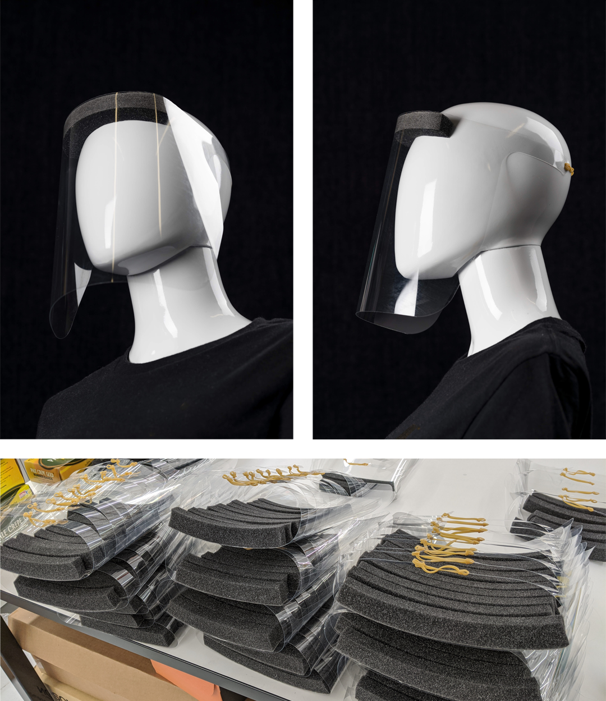

# Project Trestle: COVID-19 Face Shield

This is not an officially supported Google product.

This is a design for a Face Shield that is intended for medical use to address short-term medical supply shortages as a result of the COVID-19 public health emergency.

Face Shields manufactured from this design are single-use and only intended to be used for the duration of the declaration that circumstances justify the authorization of emergency use under Section 564(b)(1) of the Act, 21 U.S. Code 360bbb-3(b)(1) unless the authorization is terminated or revoked sooner; they should be discarded thereafter.

## Face Shield Description
Face Shields manufactured from this design are to be used to protect the user's eyes and face from bodily fluids or liquid splashes. The face shield is to be situated at the crown of the head and is constructed with plastic to cover the user’s eyes and face.

This Face Shield design has not been cleared or approved by the US Food & Drug Administration (FDA).  They have been authorized by FDA under an Emergency Use Authorization for use by healthcare providers as personal protective equipment.

## Project Motivation
For health care providers and first responders, personal protective equipment (PPE), such as N95 masks and face shields are crucial to limit exposure of medical professionals to the coronavirus that causes COVID-19. Supply chain shortages and [elevated needs](https://www.who.int/news-room/detail/03-03-2020-shortage-of-personal-protective-equipment-endangering-health-workers-worldwide) have resulted in a shortage of PPE in hospitals and clinics. The lack of sufficient stock has resulted in medical staff [rationing](https://www.sfchronicle.com/health/article/Bay-Area-health-care-workers-dealing-with-15144086.php) and [re-using](https://www.businessinsider.com/doctors-new-york-treating-coronavirus-patients-reuse-n95-masks-2020-3) masks and face shields until they are contaminated or unusable.

Using readily available materials, Google’s ATAP team is rapidly producing PPE for California hospitals and health care providers that meets the current [“crisis capacity”](https://www.cdc.gov/coronavirus/2019-ncov/hcp/ppe-strategy/face-masks.html#crisis-capacity) demand. This proof-of-concept bridge to production is designed to meet the immediate needs of local hospitals and to provide best practices to new manufacturers adapting existing fabrication pipelines to produce millions of PPE units.

## Face Shield Materials and Assembly
To facilitate the production of this face shield design by others with access to materials and people resources, here is a link to our [assembly instructions (TrestleGuide.pdf)](docs/TrestleGuide.pdf).

## Lessons Learned
The design of the Project Trestle face shield was developed based on a survey of existing designs, along with geometries and common materials employed in standard medical face shields that are used in hospitals and clinics. Prototyping in ATAP’s Skunkworks and receiving firsthand feedback from clinicians at local hospitals resulted in several lessons learned and design guidelines. We share these in the hopes that they will be useful to others following a similar course of action:

* The foam at the top of the visor should extend across the entire forehead in order to prevent droplets from contacting the clinician’s face from above; a 9” long foam strip offered the best coverage of those tested. To provide ample space between a care provider’s face and the shield, we recommend 1” thick x .75-1” wide foam.
* The visor should extend across the face from roughly the center of each ear, a 13” width (measured when the visor is flat). Clinicians disliked prototypes whose visors completely covered the ears, deeming them claustrophobic and citing difficulties hearing others speak.
* The visor length should extend below the chin. A length of 9-10” (measured from the top edge of the visor to the bottom edge) is preferable.
* Visor thickness can range from 0.005”-0.02.” Acceptable materials include rPET, PLA (cellulose acetate), PET, and polycarbonate. The visor material should not fog or become opaque when wiped with disinfecting wipes, such as bleach wipes or [Sani-Cloth](https://pdihc.com/products/environment-of-care/super-sani-cloth-germicidal-disposable-wipe/) germicidal wipes.   
* In a hospital setting, clinicians requested a disposable shield instead of a reusable shield.

## Face Shield Instructions for Use
These Face Shields are intended for use in combination with an FDA- or NIOSH- certified respiratory protective device (RPD). They should be worn over the certified RPD to provide an additional physical barrier between the wearer and third parties. These face shields are single-use, disposable devices.

Before using these Face Shields, all medical staff who will be interacting with the device MUST read and understand the Instructions & Safety Information provided in this document.

**To use Face Shields: Place foam front against your forehead. Secure elastic band around the back of your head.**

## Face Shield Safety Information
* These Face Shields are intended to be an additional protective layer along with other PPE, and not intended to be a substitute for a surgical mask. When used correctly, they can offer protection to a user’s eyes and face, when no FDA cleared alternatives exist.
* The body-contacting materials of these Face Shields are: polyurethane foam or EPDM (ethylene propylene diene monomer) rubber, PET (polyethylene terephthalate) or cellulose acetate or polycarbonate plastic film, and a natural rubber band).
* These Face Shields have not been tested for safety and qualified healthcare facility administration must use their best judgement regarding their use.
* Healthcare providers are responsible for ensuring the safe use of these Face Shields.
* The Face Shields, like any PPE, should be used according to your specific facility policies.
* The FDA has authorized the emergency use of the Face Shields until the U.S. Department of Health and Human services declares that the Emergency has ended; whenever possible, healthcare facilities should continue to use FDA-cleared devices.

## Warnings
* Immediately discard the Face Shield if damaged or torn.
* The Face Shields do not protect fully from impact hazards. Please use additional eye protection appropriately.
* The Face Shields as assembled are non-sterile.
* The use of the Face Shields alone is not sufficient to provide complete protection.
* The Face Shields may cause allergic reactions.  If you have plastic, rubber or polyurethane allergies, the materials of these Face Shields may cause an allergic reaction or skin irritation.

## Contraindications
* **Caution:** not intended to be used in a surgical setting or for other uses where sterility is required.
* **Caution:** not intended to be used where there is significant exposure to liquid, bodily or other hazardous fluids, or in a clinical setting where the infection risk level through inhalation exposure is high.
* **Caution:** it is not intended to be used in the presence of a high intensity heat source or flammable gas.
* **Caution:** it is not intended for antiviral or antimicrobial protection and does not include particulate filtration.
* **Caution:**  not intended to provide radiation protection.
* **Caution:**  not intended to be used without an FDA- or NIOSH- certified RPD.

## Contributing
We are not accepting pull requests.  However, you're welcome to fork this project and make design changes to address the needs of your particular healthcare provider.

## Connecting to other COVID-19 Efforts
* [State of California COVID-19 Medical Supply Contributions](https://covid19supplies.ca.gov/)
* [GetUsPPE.org](https://getusppe.org/) is an effort for offering and for finding PPE. Efforts as part of that include [FindTheMasks.com](https://findthemasks.com/).

## Limitation of Liability
This Face Shield design is being provided as a free service during this public health emergency. This design has not been cleared for medical use by the U.S. Food and Drug Administration. This design has not been evaluated for the prevention of specific diseases or infections, the filtering of surgical smoke or plumes, the filtering of specific amounts of viruses or bacteria, or the killing or reduction of the amount of viruses, bacteria or fungi. Healthcare facilities are responsible for decisions regarding appropriate personal protective equipment for personnel. THIS FACE SHIELD DESIGN IS BEING PROVIDED “AS IS” WITHOUT ANY EXPRESS, IMPLIED OR STATUTORY WARRANTIES OR REPRESENTATIONS MADE BY OR ON BEHALF OF GOOGLE OR ITS AFFILIATES (INCLUDING THE IMPLIED WARRANTIES OF MERCHANTABILITY AND FITNESS FOR A PARTICULAR PURPOSE), AND WITHOUT ANY IMPLIED OR EXPRESS OBLIGATIONS BY GOOGLE OR ITS AFFILIATES FOR INSTRUCTION, MAINTENANCE, AND/OR SUPPORT. TO THE MAXIMUM EXTENT PERMITTED BY LAW, GOOGLE AND ITS AFFILIATES ARE NOT RESPONSIBLE FOR AND EXPRESSLY DISCLAIM ALL LIABILITY, INCLUDING WITHOUT LIMITATION, FOR DIRECT, INDIRECT, INCIDENTAL, CONSEQUENTIAL, PUNITIVE, AND SPECIAL OR OTHER DAMAGES, ARISING FROM OR RELATED TO THE USE OF THESE FACE SHIELDS. BY ACCEPTING AND USING THIS FACE SHIELD DESIGN, YOU AGREE, TO THE FULLEST EXTENT PERMITTED BY APPLICABLE LAW THAT YOU USE THESE FACE SHIELDS AT YOUR OWN RISK AND WILL HOLD GOOGLE AND ITS AFFILIATES HARMLESS FROM ANY AND ALL CLAIMS ARISING FROM OR IN CONNECTION WITH ANY ACT OR OMISSION OF THE HEALTHCARE FACILITY, ITS EMPLOYEES OR AGENTS, IN USING THIS FACE SHIELD DESIGN PROVIDED BY GOOGLE OR ITS AFFILIATES.

When used in accordance with the Instructions for Use, the Face Shields are intended to be a Covered Countermeasure pursuant to the US Secretary of the Department of Health and Human Services’ Declaration under the Public Readiness and Emergency Preparedness Act for medical countermeasures against COVID-19 (COVID-19 Declaration) effective February 4, 2020.
